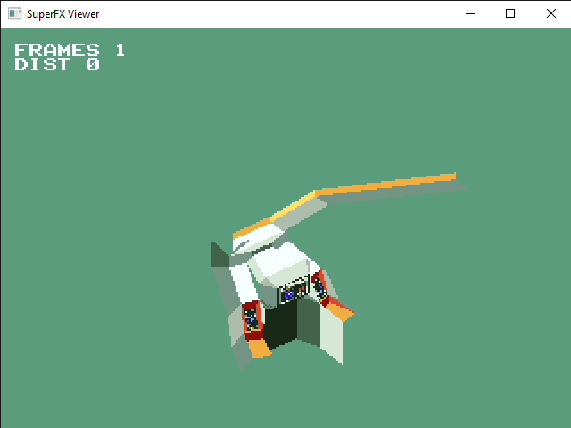

# sfxObjectDump
Parses 3d mesh data from Starfox rom

<pre>
Usage: sfxobjdump &lt;romfile&gt; &lt;vertex list address&gt; &lt;face data address&gt;

	-f &lt;n&gt;	Frame n only
	-b &lt;basename&gt;	Set base filename.
			Output filenames will be be in format "Basename nn"
	-v	Verbose output
	-t	Validate only.
	-g	Triangulate faces
	-m	Generate materials file
</pre>

Currently only outputs the data in .obj format. For animated objects, it will output one .obj for each frame.

Does not currently handle textures from the rom, but is intended to be added. Contributors welcome.

Should also work with Starfox 2, and is expected to work with all other SuperFX games such as Vortex, Stunt Race FX, and Dirt Trax.

#### Examples

```bash
$ bin/Release/sfxobjdump -gm [Path to ROM] 0x82EF9 0x82FAF
```


#### OpenGL Previewer

See [README.txt](viewer/README.txt) for building instructions.

```bash
$ viewer/SuperFXViewer.exe [Path to ROM]
```





